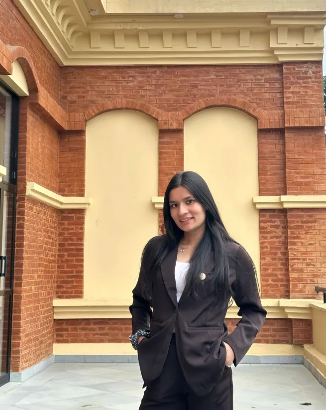

# Kusum KC Portfolio Website

## Overview
 A dedicated **Dairy Technology student** with strong knowledge of dairy processing, food safety,  microbiology and quality control. Able to manage tasks responsibly, communicate well, and work effectively in team environments. Actively involved in student leadership as Secretary of NEFTSA CAFODAT and committed to continuous learning and professional growth.